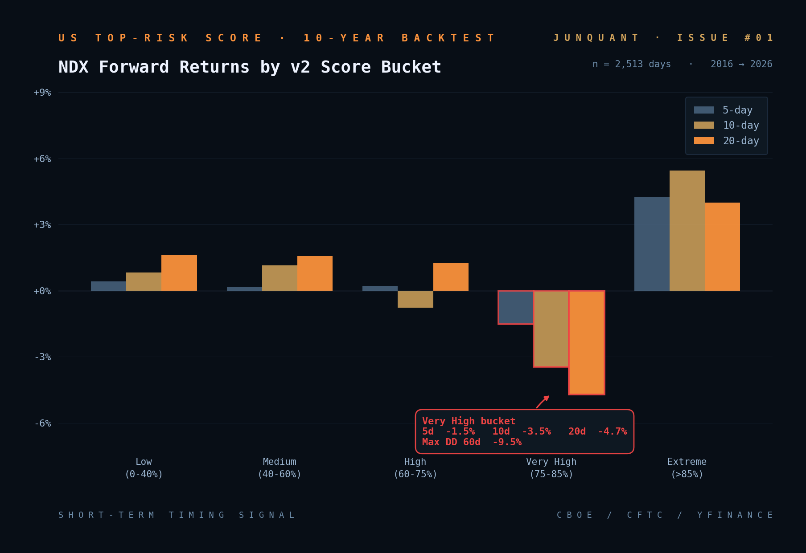

# 美股拥挤度实验室 #01 · 用免费数据搭建美股短期顶部预警系统

> 8 维信号合成 / 10 年回测验证 / v1 失败 → v2 改进的完整故事

[完整文章 (中文)](https://junquant.com/research/us-market/01) ·
[实时评分 API](https://junquant.com/api/us-market/score-v2/latest) ·
[栏目首页](https://junquant.com/research/us-market)

---

## 这一期讲什么

机构有 Goldman / Morgan Stanley / Barra 的拥挤度数据,年订阅费六位数美元。这个项目用**完全免费**的公开数据 (Yahoo Finance / CFTC / CBOE / Stooq) 搭一套个人投资者也能用的版本。

核心研究流程:

1. **v1 设计** — 教科书思路:因子 z-score + SOX 偏离 + VIX 异常 = 高分
2. **v1 失败** — 5 年回测显示高分桶反而对应正回报 (牛市样本里 z 极端 = 突破延续)
3. **v2 重设计** — 加入方向性 (z 从峰值回落)、共振要求 (3 信号同时激活)、领先指标
4. **v2 在 10 年回测中验证** — 5-20 天有显著预测力 (Very High 桶 10 天 -3.5%),但 30 天后失效

**结论: v2 是短期 timing 工具,不是中期方向工具。**

---

## 数据(2026-04-29 → 2026-05-01)

```bash
$ python -m us_market_dashboard score-v2

🎯 v2 风险评分细分
日期: 2026-05-01
确认评分: 33% (从 04-29 的 21% 上升)
激活子信号: 2/5

  ⚪ 1. 因子反转          0.00
  🟠 2. SOX 反转          0.79  ← 新激活!
  🔴 3. CFTC 极端持续     1.00
  ⚪ 4. VIX 上升          0.00
  ⚪ 5. 领先指标转弱       0.06

🟡 综合判断: 个别信号偏高但未形成共振
```

实时评分 (网页右侧):



---

## 关键回测结果 (10 年, 2,513 个交易日)

| v2 评分桶 | n | 5d | 10d | 20d | 30d | 60d 最大回撤 |
|---|---:|---:|---:|---:|---:|---:|
| Low (0-40%) | 2,429 | +0.41% | +0.82% | +1.60% | +2.28% | -5.22% |
| Medium (40-60%) | 47 | +0.15% | +1.15% | +1.57% | +2.40% | -6.72% |
| High (60-75%) | 28 | +0.21% | -0.78% | +1.25% | +6.98% | -5.40% |
| **Very High (75-85%)** | **6** | **−1.52%** | **−3.47%** | **−4.71%** | +1.50% | **−9.46%** |
| Extreme (>85%) | 3 | +4.24% | +5.45% | +3.98% | +5.17% | -0.11% |

**Very High 桶 (n=6) 在 5-20 天显著负回报,但 30 天后均值回归。最大回撤平均 -9.5%,几乎是 Low 桶的 2 倍。**

---

## 快速复现

```bash
cd us-market/01_top_risk_score
pip install -r us_market_dashboard/requirements.txt

# 一次性拉 10 年历史 (5-15 分钟)
python -m us_market_dashboard extend-history --years 10

# 看当前评分
python -m us_market_dashboard score-v2

# 跑 10 年回测验证
python -m us_market_dashboard backtest --version v2
```

---

## 子目录结构

```
01_top_risk_score/
├── README.md                       (本文件)
├── docs/                           (图表资源)
│   ├── cover.png                   栏目封面 (网站用)
│   ├── figure_1_bucket_returns.png 分桶回报对比
│   └── figure_2_horizon_decay.png  时间窗口衰减
└── us_market_dashboard/            完整可运行 Python 模块
    ├── collectors/                 数据采集 (yfinance / CBOE / CFTC)
    ├── analyzers/                  信号计算 (拥挤度 / CTA / risk_score_v2)
    ├── backtest/                   回测引擎
    ├── notifiers/                  Markdown 报告 + Telegram
    ├── storage/                    SQLite 持久化
    ├── config/settings.py          所有阈值、ETF 映射
    ├── tests/smoke_test.py         合成数据集成测试
    ├── main.py                     CLI dispatcher
    └── requirements.txt
```

---

## 8 维信号说明

| # | 信号 | 来源 | 频率 |
|---|---|---|---|
| 1 | 5 个因子拥挤度 (z-score + 滚动分位) | yfinance ETF 多空对 | 日 |
| 2 | SOX 偏离 20MA | yfinance | 日 |
| 3 | CTA 趋势资金 (多周期均线) | yfinance | 日 |
| 4 | CFTC TFF 持仓 (Lev Money vs Asset Mgr) | cftc.gov 周报 | 周 |
| 5 | VIX 期限结构 (VIX/VIX3M, level, 5d 变化) | yfinance | 日 |
| 6 | CBOE SKEW | yfinance | 日 |
| 7 | 5 个领先指标对 (HYG/LQD, IWM/SPY, ...) | yfinance | 日 |
| 8 | 历史 PCR 分位基线 | CBOE 2006-2019 归档 | 静态 |

---

## 已知限制

1. 样本期 2016-2026 不含 2008 GFC / 2000 互联网泡沫
2. CTA 信号是简化代理 (无波动率目标 + 风险平价)
3. 拥挤度用 ETF 而非个股因子暴露
4. 领先指标对可能过拟合美股市场结构
5. 短期信号不能预测幅度 (只能预测"5-20 天大概率回调 3-5%")
6. CFTC 数据有 3 天报告滞后

---

## 部署在 junquant.com

- **Web**: 文章页 `/research/us-market/01` 含实时评分 + hover 5 子信号细分
- **API**: `/api/us-market/score-v2/latest` 返回 JSON
- **Cron**: SGT 07:00 daily 自动更新

---

## License

MIT (见仓库根目录 LICENSE)。**这是研究工具,不是投资建议**。
